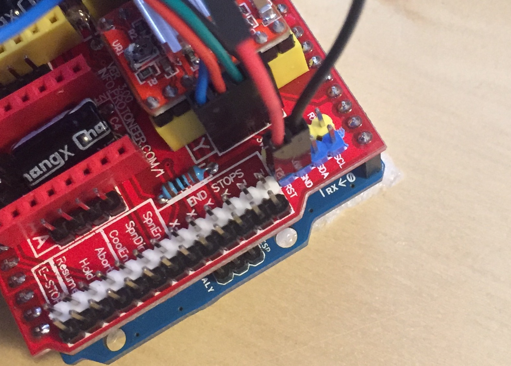
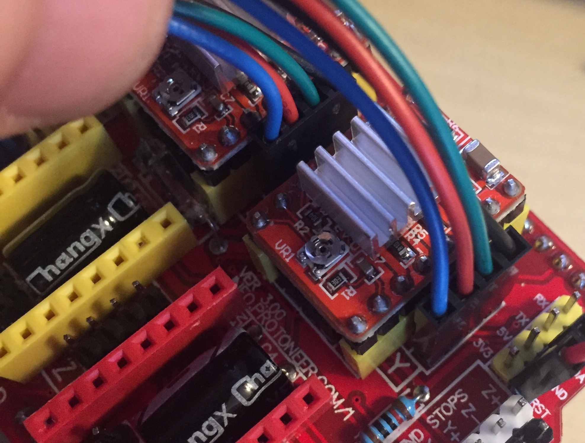
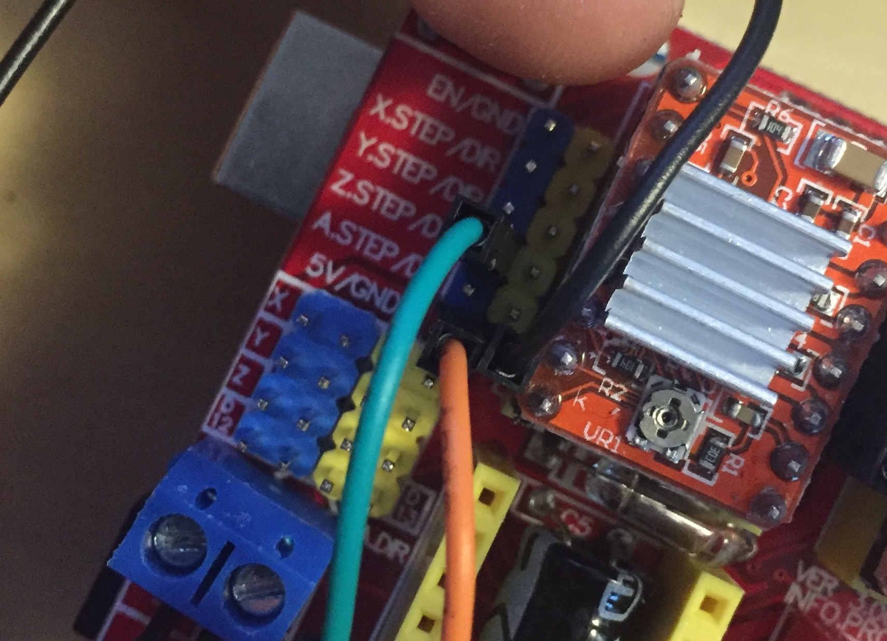

# CAD

# Installazione

Per farlo funzionare serve OBBLIGATORIAMENTE il condensatore per disabilitare l'autoreset, condensatore da 10 µF posizionato su il pin RST GND; questo deve essere tolto ogni volta che si vuole reflashare la board



I motori girano giusti se mantengono questo ordine di fili dal basso verso l'alto (B)(R)(G)(BK)



Per il servo motore invece ho usato la posizione dei pin indicata nel firmware che è questa MARRONE->GND ROSSO->5V ARANCIO->Z.STEP



# Firmware

Usata la fork di plex3r, volendo ha anche dei file da sostituire se il plugin su inkscape non funzionasse, però a me è andato senza problemi

[EggDuiono_plex3r](./firmware/EggDuino_plex3r)

# Estensione

Installa Inkscape

```bash
brew cask install InkScape
```

Poi installa l'estensione da [EggBot_v2.5.0_Mac.dmg](./firmware/EggBot_v2.5.0_Mac.dmg)

Dentro ci sono anche dei file di esempio

# TODO

<!-- - [x] per mettere il tik -->
- [ ] mettere switch per permettere di flashare senza togliere il condensatore
- [ ] ricontrolla come si calcola la VREF perchè cristian dice che quella spiegazione era un pochino errata ma in così per ora funzione ed è molto bassa
- [x] il cuscinetto sul filetto non si può vedere
- [x] migliorare il porta cuscinetto
- [x] soluzione più stabile del pezzo che porta la barra filettata
- [x] dove si inseriscono le barre metti delle viti per bloccare saldamente la barra
- [x] i fori stampati risultano leggermente troppo grandi in tutte le parti forse è un errore di stampa mio ma controlla sul file originale
- [x] al portapenna, cambia posizione del blocca penna e metti un pomellino
